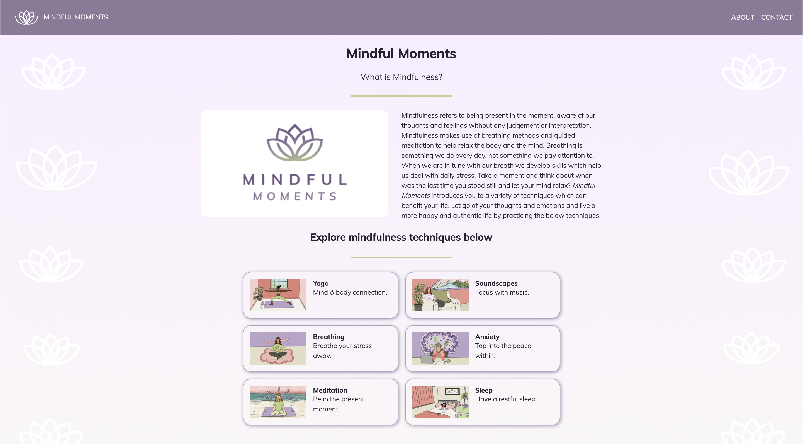

# Code First Girls Project - Mindful Moments

Mindful Moments is a page built for people who wish to learn how to take a moment and step away from daily stress,technology and distractions. Built as part of the Code First Girls Web Development course.

## Features:

The project features a user interactive section on the Yoga page which displays helpful videos according to user's needs. Select one thing your body needs and one area you want to focus on. This will display a video. You can unselect your choice and select something else, which will display a different video.

The Homepage shows random mindfulness quotes when the page loads.

## How to use:

Use the [Live Preview VS Code plugin](https://marketplace.visualstudio.com/items?itemName=ms-vscode.live-server) to preview project.

Deployed to [GitHub Pages](https://pages.github.com) [here](https://laura-dumitru.github.io/code-first-girls-team-project).
